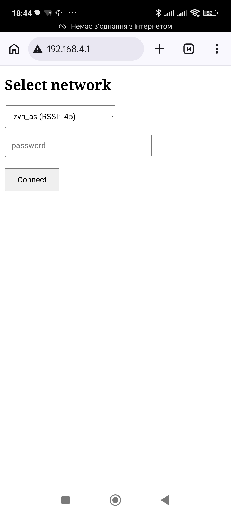
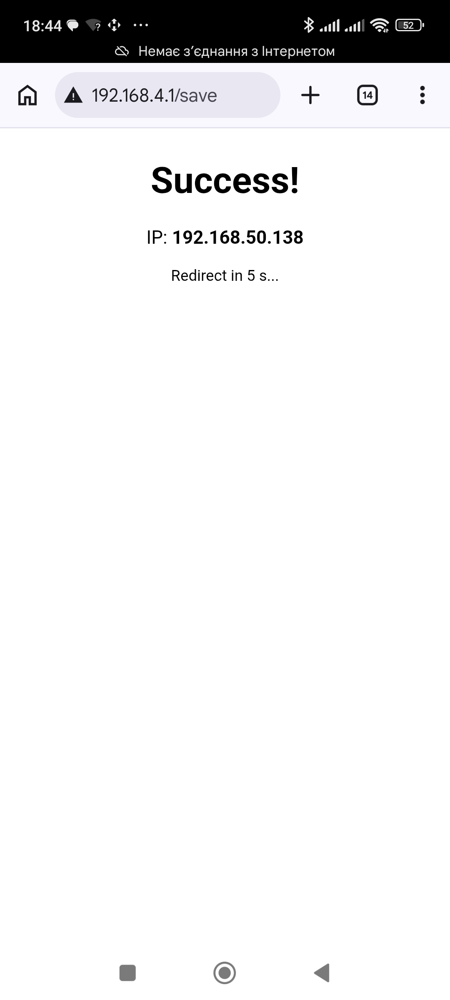
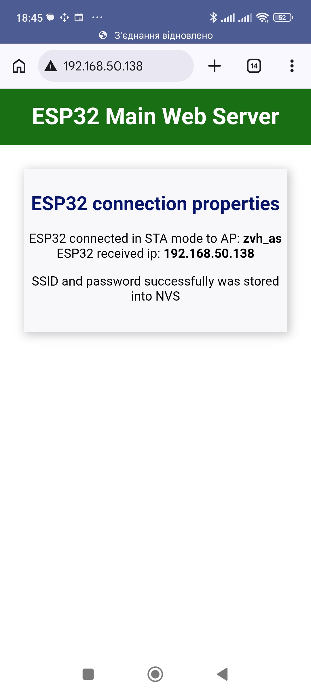

# ESP32 Runtime Wi-Fi Configuration

A demonstrative project for ESP32 using the **ESP-IDF** framework and **VS Code**. This application shows how to implement dynamic Wi-Fi connection setup during runtime without hardcoding credentials in the source code.
The app also allows to change existing connection settings using a physical button. Holding the button down for 5 seconds or more clears the credentials stored in the NVS. The expiration of the 5 seconds is confirmed by a blinking LED on the debug board connected to pin 2.

## 🚀 Features
*   **Runtime Configuration**: Setup Wi-Fi connection while the application is running.
*   **ESP-IDF Native**: Built using the native Espressif IoT Development Framework.
*   **Event-Driven**: Uses the ESP-IDF event loop for robust connection handling.

## 🕹 Usage
1. Power on your ESP32. If no Wi-Fi credentials are found in NVS, it will start in **SoftAP mode**.
2. Connect your phone or PC to the Wi-Fi network created by the ESP32 (for this example SSID=**`ESP32_Setup`** and pwd=**`12345678`**).
3. Open your web browser and go to: **`http://192.168.4.1`** (default ip)
4. Scan for networks, select yours, enter the password, and click **Connect**.

## 📱 Web Interface Screens
<p align="center">
  
  
  
</p>

## 🛠 Hardware & Software Requirements
*   **Hardware**: ESP32 development board (e.g., ESP32-WROOM-32).
*   **Toolchain**: ESP-IDF v5.x (tested with version 5.5).
*   **IDE**: Visual Studio Code with ESP-IDF Extension.

## 📁 Project Structure
*   `main/`: Contains the main source code (`main.c`).
*   `sdkconfig`: Project configuration (not included in repo, generated by IDF).
*   `.gitignore`: Properly configured for ESP-IDF to exclude build artifacts.

## 🔧 How to Build & Flash
1.  **Clone the repository**:
    ```bash
    git clone https://github.com/Valerii-Z/esp32-runtime-wifi-setup
    ```
2.  **Open in VS Code**:
    Launch VS Code and open the project folder.
3.  **Configure**:
    Run `idf.py menuconfig` or use the ESP-IDF Extension GUI to set any specific parameters.
4.  **Build and Flash**:
    Use the shortcut `Ctrl+E, Flash` or the icon in the status bar to compile and upload the code to your ESP32.

## 📝 License
This project is open-source and available under the [MIT License](LICENSE).

